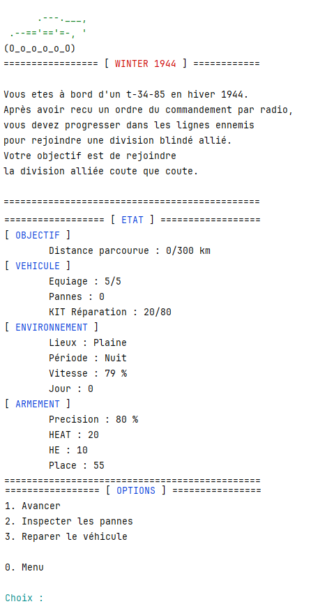
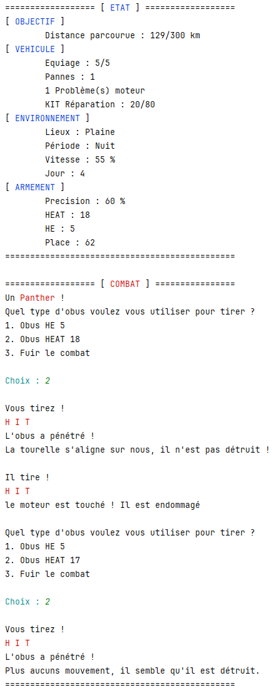

# ❄️ Winter 1944

**Winter 1944** est une réinterprétation du classique "Jeu du Chameau", entièrement remaniée pour offrir une expérience de jeu inspirée de la Seconde Guerre mondiale. Cette version introduit des mécaniques de jeu enrichies, telles qu'un système de combat, un inventaire avancé et des événements immersifs, pour ajouter de la profondeur au gameplay.

## 🔍 Contexte du jeu

Plongé en plein hiver de 1944, vous incarnez un soldat allié traversant des terres hostiles, où vous devez jongler entre vos ressources et les menaces environnantes pour survivre. Votre objectif est de traverser le terrain enneigé sans manquer de provisions ni être éliminé par l'ennemi.

## 🚀 Fonctionnalités principales
- **Système de combat** : engagez-vous dans des batailles pour avancer dans le jeu.
- **Système d'environement dynamique** : l'environnement a un impact sur la visibilité, la vitesse ou votre éfficacité en combat, comme lors de la nuit, lorsque il pleut, ou lorsque le terrai est dégagé...
- **Gestion de l’inventaire** : gérez vos ressources de façon stratégique pour ne pas manquer de munitions ou ne pas trop abimer votre char!
- **Graphismes textuels** : une ambiance immersive grâce à des descriptions et des événements textuels qui plongent le joueur dans la période.

 

 